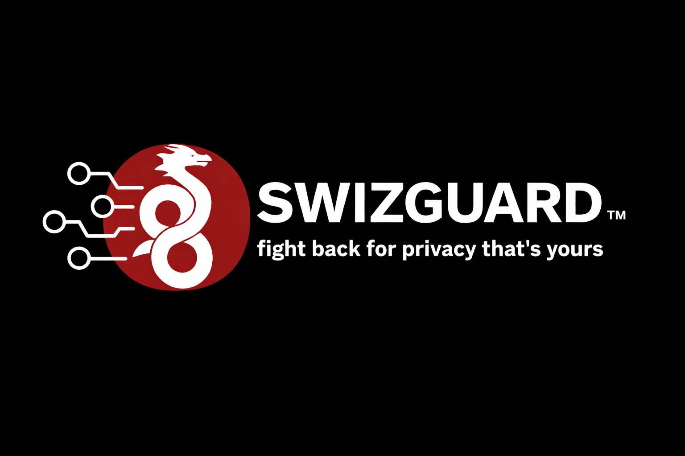

<p align="center">
  
</p>

# SwizGuard

Self-hosted stealth VPN. Your traffic looks like normal HTTPS to a major website. Your ISP has no idea you're tunneling anything. Works on Mac, Linux, Windows, iPhone, and Android. One command deploys the server, another spits out configs for every device you own.

## Why I built this

I travel a lot. Hotel Wi-Fi, sketchy airport networks, countries where half the internet is blocked or actively monitored. I got tired of running into the same three problems over and over.

First one: regular VPNs get blocked. Not just in the obvious places like China or Iran. Corporate networks, coffee shops with weird filtering, hotel Wi-Fi that throws up captive portals and then flags WireGuard traffic. You fire up NordVPN and it just... doesn't work. Or it works for ten minutes and then the network figures out what you're doing and cuts you off.

Second one: consumer VPNs want you to trust them. Nord, Express, Mullvad, whoever. They all promise "no logs" but you're taking their word for it. Their entire business model requires you to believe them about something you can't verify. I'm not comfortable handing my traffic to a company I can't audit, especially when that company owns the exit point for everything I do online.

Third one: my family. My partner, my parents, people who aren't going to SSH into a VPS and fiddle with configs. I wanted something I could set up once and then just hand them a file that makes their phone work safely anywhere. No monthly subscription, no app full of ads, no trusting some random Panama corporation with their browsing history.

The existing options all suck in different ways. WireGuard alone is fast and clean but trivially detectable — every modern DPI system can fingerprint it in milliseconds. OpenVPN is slower AND detectable. Commercial VPNs are blocked and require trust. Tor is anonymous but too slow for daily use and not really designed for "just let me check email on hotel Wi-Fi."

So I built what I actually wanted. Something that:

- Looks like HTTPS to microsoft.com to anyone watching, because that's literally what the bytes on the wire say
- Runs on my own $5 VPS, so I'm the only one with access to the keys and the logs (the logs don't exist by default)
- Works on iPhone with one file import, not "sideload this custom IPA and jailbreak your phone"
- Deploys with one command so I can stand up a new server in 60 seconds if I need to move jurisdictions
- Doesn't ask my family to understand VLESS or REALITY or any of the underlying protocols — they just get a file, import it, tap connect

SwizGuard is the result. I use it every day on my Mac and my iPhone. My partner uses it. I've set it up for family members I trust but would never trust to maintain it themselves. If you have similar reasons — you travel, you don't trust consumer VPNs, you want actual privacy without the BS — this is for you.

## What it actually does

A normal VPN shows up on the wire as "this is a VPN." Wireshark can see it, DPI can fingerprint it, corporate firewalls can block it. WireGuard's handshake pattern is unique. OpenVPN's TLS handshake doesn't match real browsers. Even Nord and Express use IP ranges that every firewall vendor has already flagged.

SwizGuard is different. It wraps your WireGuard tunnel inside VLESS+REALITY with Vision flow, which is a protocol stack designed to be cryptographically indistinguishable from a real HTTPS connection to a real website. When someone probes your server, they get a real Microsoft certificate — because REALITY proxies the handshake to the actual microsoft.com edge server and returns whatever comes back. There's nothing fake to detect.

What your ISP sees:
```
your device → TLS 1.3 → www.microsoft.com
```

What's actually happening:
```
your device → Xray/sing-box (WireGuard → VLESS → REALITY → Vision) → your VPS → real internet
```

Three layers of encryption. Zero signal that a VPN exists. No third party in the trust chain except your own VPS provider.

## What this looks like on the wire

This is the part that matters. Here's what an observer (your ISP, a corporate firewall, a censoring government) actually sees in Wireshark.

### Plain WireGuard


Every packet is labeled `WireGuard`. Wireshark identifies the protocol immediately because the handshake pattern is unique and the transport headers are distinctive. Any DPI system, any modern firewall, any network operator with basic tooling can flag these packets in milliseconds. They don't need to decrypt anything — the protocol identification IS the fingerprint.

The "Info" column even shows packet types: `Transport Data, receiver=0x..., counter=...`. That's WireGuard's internal session structure leaking out. To a censor, this is a screaming neon sign that says "VPN here, please block me."

### SwizGuard


Every packet is labeled `TLSv1.2` or `TCP`, port 443, "Application Data". This is what HTTPS to any normal website looks like in Wireshark. Same shape as Safari loading microsoft.com, or Mail checking iCloud, or your phone updating an app.

There is no `WireGuard` label anywhere because WireGuard is happening **inside** the encrypted TLS session. Wireshark doesn't know it's there. DPI doesn't know it's there. Your ISP doesn't know it's there. The fingerprint that gives away plain WireGuard isn't visible because it's wrapped inside REALITY's outer TLS layer, and Vision flow pads the inner handshake to defeat the TLS-in-TLS detection technique that catches naive nested TLS proxies.

### Why this matters

In a normal day on a normal home network in the US, the difference between these two captures is mostly philosophical — your ISP isn't actively blocking VPNs, so plain WireGuard works fine. But the moment you step outside that environment, the difference becomes the difference between "I have internet" and "I don't."

- **Hotel and airport Wi-Fi.** Many of them block known VPN protocols to enforce captive portal terms or to throttle "non-business" traffic. Plain WireGuard gets dropped. SwizGuard goes straight through because it's just HTTPS.
- **Corporate networks.** Most enterprise firewalls are configured to identify and block VPNs by default. Plain WireGuard fails. SwizGuard looks like browsing microsoft.com — and ironically, in a Microsoft 365 environment, that traffic pattern is so common it's invisible.
- **State censorship.** China's GFW, Russia's TSPU, Iran's filtering — all use deep packet inspection that fingerprints VPN protocols. Plain WireGuard is dead the moment you cross the border. SwizGuard works because nothing in the wire format gives away the VPN.
- **Surveillance environments.** Even when you're not blocked, the simple fact that "Jake is using a VPN" is metadata. Your ISP can sell that, log it, hand it over with a subpoena, or use it as a flag in an automated system. With SwizGuard, that metadata doesn't exist — there's nothing to tell your ISP that anything unusual is happening.

The Wireshark difference is the entire reason SwizGuard exists. Plain WireGuard says "I am a VPN, please make decisions based on that." SwizGuard says "I am someone reading microsoft.com, please ignore me."

## How it holds up

I tested this in real conditions. My own daily use on a VPS I rent from a cheap provider, running on my Mac with system proxy enabled and my iPhone using sing-box via SFI. Here's what I can verify:

- My ISP sees HTTPS traffic to microsoft.com. That's it. I checked with Wireshark from a separate machine on the same LAN.
- Active probing my VPS returns Microsoft's real certificate served through Akamai's CDN. I confirmed this by running `curl --resolve www.microsoft.com:443:MY_VPS_IP https://www.microsoft.com` and getting a real HTTP/2 200 back from AkamaiGHost with a valid DigiCert cert.
- The WireGuard layer is running underneath. I confirmed this by SSH'ing to the VPS and running `sudo wg show wg1`, which shows my clients connecting with `endpoint: 127.0.0.1:xxxxx` — loopback, meaning the WG packets are arriving via the REALITY unwrap path.
- Firefox throws a "cert doesn't match IP" warning if I visit my VPS IP directly. That's the same warning you'd get hitting any Akamai edge server by IP — it's a feature, not a bug.

None of this is me trusting someone else's marketing copy. It's stuff I can point Wireshark at and see for myself.

## Features

- **Full WireGuard + VLESS + REALITY + Vision chain on every platform** — same architecture on desktop and mobile, generated from one command
- **Vision flow (`xtls-rprx-vision`)** — closes the TLS-in-TLS fingerprint that catches plain VLESS+REALITY
- **Single process on the client** — no wg-quick, no kernel tunnel, no sudo to start the tunnel
- **Desktop uses Xray-core** with chained outbounds via `sockopt.dialerProxy`
- **Mobile uses sing-box via SFI/SFA** with chained endpoints via `detour`
- **Zero access logs on the server** — the VPS doesn't record where you go
- **Pairs with VPS hardening scripts** — auto-detects UFW and only opens port 443
- **microsoft.com is the default camouflage** — Xray specifically warns against apple.com and icloud.com, so I avoid those
- **Works on a $5 VPS** — I run mine on one of the cheapest tiers, it keeps up fine

## Requirements

### Server
- Debian 12 or 13, or Ubuntu 22.04 or 24.04 (amd64 or arm64)
- Root access
- Any cheap VPS — Vultr, Linode, Hetzner, DigitalOcean, whatever
- Port 443/tcp open to the internet

### Desktop (macOS / Linux / Windows)
- `xray-core` v1.8 or newer, v26.x recommended
- macOS: `brew install xray`
- Linux: grab a binary from `github.com/XTLS/Xray-core/releases`
- Windows: same releases page, add `xray.exe` to PATH

### iPhone
- iOS 15 or later
- **SFI (Sing-Box For iOS)** from the App Store
- If the App Store version is stale, the TestFlight build usually has the latest sing-box core

### Android
- **SFA (Sing-Box For Android)** from Play Store, or
- **v2rayNG** if you prefer Xray natively

## Quick start

### Step 1 — set up the server

On a fresh VPS, ideally after running a hardening script first (see below):

```bash
git clone https://github.com/YOUR_USER/swizguard.git
cd swizguard
sudo ./swizguard setup
```

That's it. Sixty seconds later you have:
- Xray-core installed and running on port 443 with VLESS + REALITY + Vision
- A WireGuard server on localhost:51821 (never exposed externally)
- Camouflage set to `www.microsoft.com`
- REALITY keys, WireGuard keys, client UUID, short ID — all generated and saved
- Systemd services enabled so everything survives a reboot

### Step 2 — add clients for every device you own

```bash
sudo ./swizguard add macbook
sudo ./swizguard add iphone
sudo ./swizguard add partner-laptop
sudo ./swizguard add mom-phone
```

Each client gets a package containing:
- `xray-client.json` — for desktop full chain
- `singbox-client.json` — for iOS SFI or Android SFA full chain
- `connect-<name>.sh` — launcher for desktop
- A VLESS share link and QR code (fallback for clients that can't import raw JSON)

### Step 3 — connect your desktop

```bash
# On your Mac or Linux box
scp -P 13337 -i YOUR_KEY YOUR_USER@YOUR_VPS:/etc/swizguard/clients/macbook ./
cd macbook
bash connect-macbook.sh
```

To verify:
```bash
curl --socks5 127.0.0.1:10808 -4 ifconfig.me
```

That should return your VPS IP. If you want all Mac traffic to route through the tunnel (not just apps you configure manually):

```bash
bash connect-macbook.sh enable-system-proxy
```

### Step 4 — connect your iPhone (full chain)

1. Install **SFI (Sing-Box For iOS)** from the App Store
2. Get `singbox-client.json` from the VPS onto your iPhone. Easiest way: SCP to your Mac, AirDrop to iPhone, save to Files
3. In SFI: Profiles tab → `+` → Local → pick the JSON file
4. Dashboard tab → select the new profile → Start → Allow VPN permission
5. Open Safari and visit `ifconfig.me`. You should see your VPS IP

### Step 5 — connect Android

Same file-based import, different app. Either SFA (sing-box native) or v2rayNG (Xray native). Both support the full chain.

## Commands

| Command | What it does |
|---|---|
| `./swizguard setup` | Fresh install on a new VPS |
| `./swizguard add <name>` | Generate a new client package |
| `./swizguard regen <name>` | Regenerate configs for an existing client (after server changes) |
| `./swizguard share <name>` | Print the QR code and VLESS link for an existing client |
| `./swizguard list` | List all clients |
| `./swizguard remove <name>` | Revoke a client |
| `./swizguard status` | Server health, connected peers |
| `./swizguard upgrade-vision` | Enable Vision flow on an older deployment |
| `./swizguard rekey` | Rotate REALITY keys (breaks all existing clients until regen) |
| `./swizguard nuke` | Uninstall everything |
| `./swizguard help` | Show help |

## Recommended deployment order

I pair SwizGuard with my [VPS-Lock-Figuration](https://github.com/0xXyc/VPS-Lock-Figuration) script on every box. That hardening script is what I run first on any fresh VPS — it creates a non-root user, enforces SSH key auth only, moves SSH to a custom port, enables UFW with restrictive defaults, installs fail2ban, and turns on unattended security upgrades. Run that first before you install anything else.

Then deploy SwizGuard as the non-root user with sudo. It detects UFW automatically and opens only port 443. The two scripts compose cleanly — Lock-Figuration sets the baseline, SwizGuard adds the stealth VPN on top. Total time from fresh VPS to working tunnel is under five minutes.

## Verifying the camouflage yourself

Don't take my word for any of this. Test it. From a machine that's NOT connected to the tunnel:

```bash
curl -I --resolve www.microsoft.com:443:YOUR_VPS_IP https://www.microsoft.com
```

You should see something like:
```
HTTP/2 200
server: AkamaiGHost
content-type: text/html
```

That response is coming from real Akamai infrastructure proxied through your VPS by REALITY. The certificate in the TLS handshake is a real DigiCert-signed cert for `*.microsoft.com`. Your server is behaving exactly like a Microsoft edge node because, mechanically, that's what REALITY makes it do when probed.

If you visit `https://YOUR_VPS_IP` directly in Firefox, you'll get a "cert doesn't match IP" warning. That's expected. Real Microsoft cert, wrong hostname — same behavior you'd get hitting any Akamai edge by IP address. Cert matching is domain-based, not IP-based. Firefox is confirming the camouflage.

## Documentation

- [How It Works](docs/how-it-works.md) — technical deep dive on the chain, REALITY, Vision flow, threat model
- [Setup Guide](docs/setup-guide.md) — step-by-step server deployment, client generation, mobile setup
- [Troubleshooting](docs/troubleshooting.md) — every weird issue I hit during development, and how I fixed it

## What this protects against

- Passive inspection by your ISP, network operators, corporate firewalls
- Active scanning and probing of your server
- TLS-in-TLS fingerprinting (the technique GFW uses to catch plain VLESS+REALITY)
- DPI-based VPN detection
- Commercial VPN blocklists
- Consumer firewalls at hotels, airports, coffee shops, schools

## What it doesn't protect against

I'm going to be honest about this because too many VPN tools oversell their own capabilities.

- **Global passive adversaries doing end-to-end timing correlation.** If a nation-state actor can see both your ISP traffic AND your VPS's upstream provider, they can correlate packet timing and figure out your destinations. No low-latency VPN defeats this. Tor is the answer for that threat model.
- **VPS provider compromise or legal compulsion.** If your VPS provider is subpoenaed or compromised, the attacker gets root on the box. Pick your provider and jurisdiction based on your actual threat model. Pay with Monero if you want to decouple your identity from the server.
- **Endpoint compromise.** Malware on your phone or laptop reads your traffic before encryption. No VPN helps. Keep your devices clean.
- **Behavioral deanonymization.** If you log into Google with your real name while connected, Google knows it's you. The VPN hides your network location, not your identity. These are two different things.

See [docs/how-it-works.md](docs/how-it-works.md) for the full threat model.

## Credits

This tool stands on a lot of other people's work. The protocols and primitives are all upstream:

- **[Xray-core / XTLS team](https://github.com/XTLS/Xray-core)** — REALITY protocol, Vision flow, the WireGuard outbound, and the `sockopt.dialerProxy` chaining pattern that makes the whole thing possible
- **[sing-box / SagerNet](https://github.com/SagerNet/sing-box)** — sing-box itself, the `wireguard` endpoint, and the `detour` field for chaining on mobile
- **[WireGuard](https://www.wireguard.com/)** — the VPN protocol that does the actual inner encryption
- **[Xray's Warp-over-proxy guide](https://xtls.github.io/en/document/level-2/warp.html)** — the canonical reference for how `dialerProxy` chaining is supposed to work

SwizGuard is the automation and packaging layer. It stitches these tools together into something deployable, handles the key generation and config templating, generates matching Xray and sing-box configs from one source of truth, and gives you management commands so you don't have to hand-edit JSON every time you add a device. Everything cryptographic underneath is someone else's work that I'm using as a library.

## License

MIT. See [LICENSE](LICENSE).

## Disclaimer

SwizGuard is a privacy and censorship-resistance tool. Use it legally in your jurisdiction. I make no warranty and accept no liability for misuse. I built it because I needed it for my own travel and privacy, and I'm releasing it publicly because other people probably need something similar. See [DISCLAIMER.md](DISCLAIMER.md) for the full disclaimer.
